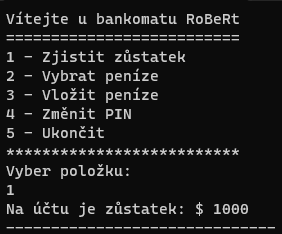

# Jednoduchý automat v C# jako konzolová aplikace

Implementace jednoduchého automatu zadaného ve škole.

Veškerý kód je okomentovaný.

## Funkce:
- Zjištění zůstatku
- Vybrání peněz
- Vložení peněz
- Změna PIN

## Ukázka


## Spuštění
Ve složce projektu
```
dotnet run
```

## Sestavení (build)
Ve složce projektu
```
dotnet build
```
